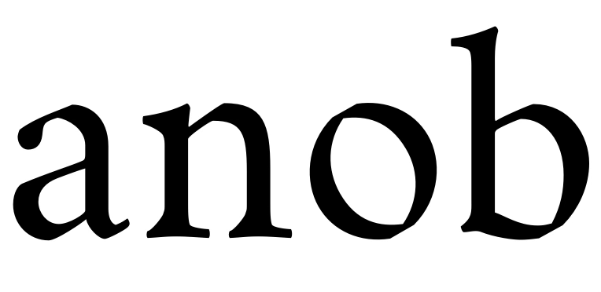
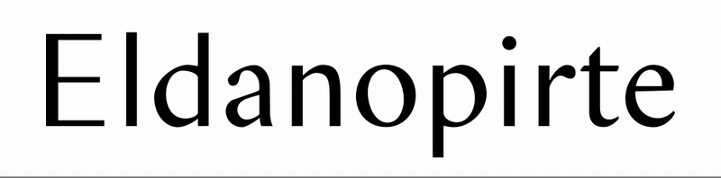
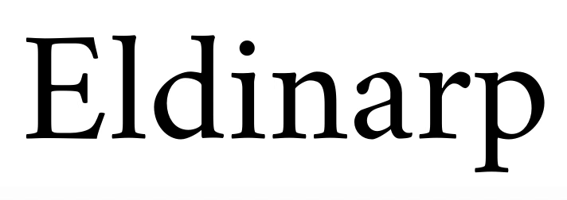
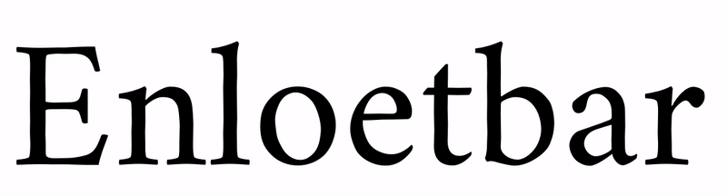
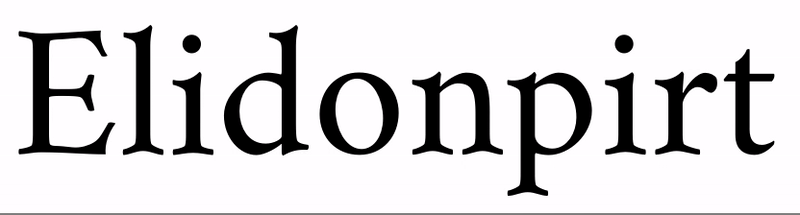

# Various variable typeface experiments, including sources
Preview/test with sliders of the variable fonts: [Variable Font Testing](http:vongebhardi.de/clients/google/variable-font-testing/) (external, based on [axis-praxis.org](http://axis-praxis.org))

## RobotoFlex
https://github.com/Manuel87/RobotoFlex (latest)

 
 
 
## CrimVarious
https://github.com/Manuel87/CrimVarious 
 
Based on Crimson by Sebastian Kosch. (https://github.com/skosch/Crimson)

### [Pen Model (Oldstyle——Modern)](PenModel/)
char-set: a, n, o, b  

### [Serif Length (Sans——Serif)](SerifLength/)
char-set: E, l, d, n, o, p, i, r, t, e  

### [Serif Spur Angle](SerifSpurAngle/)
char-set: E, l, d, i, n, a, r, p  

### [Curvature > Broken](CurvatureBroken/)
char-set: E, l, a, n, o, b  

### [Curvature > Wiggle](CurvatureWiggle/)
char-set: E, n, l, o, e, t, b, a, r  

### [Curvature > Serif (Concave——Convex)](CurvatureSerifConcave)
char-set: E, l, o, d, i, n, p, r, t  

### [Flex](CrimVarious/Flex/)
char-set: H,n,o
 
 
 
## Variable Icons

